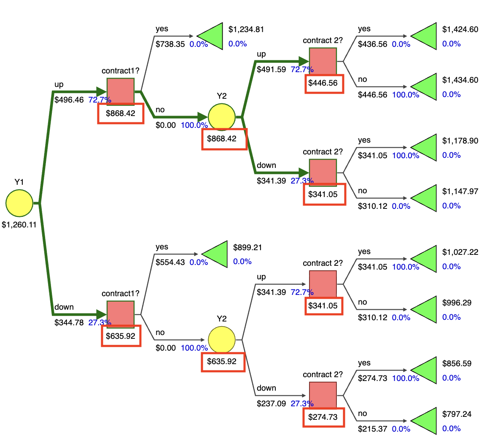
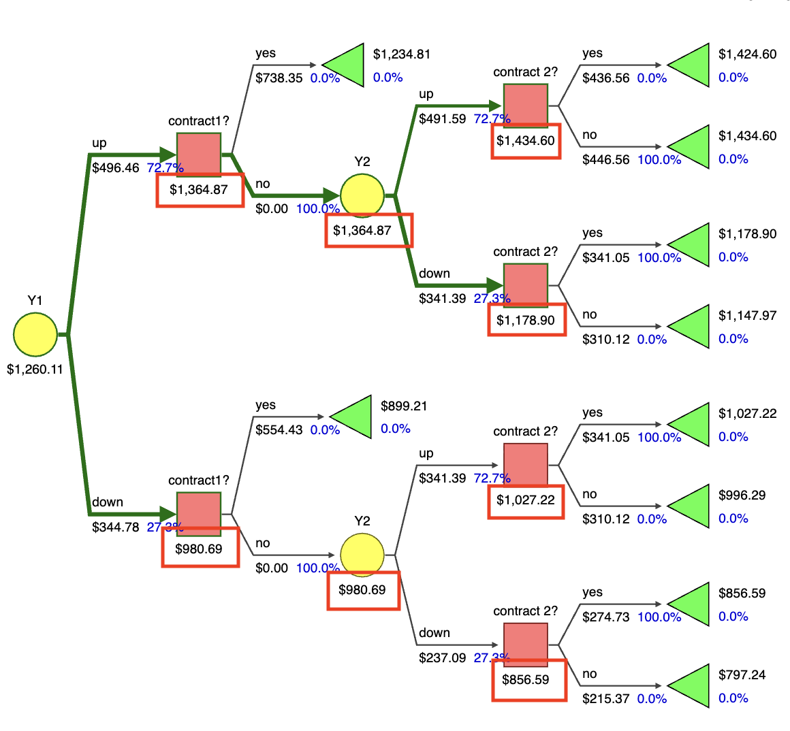
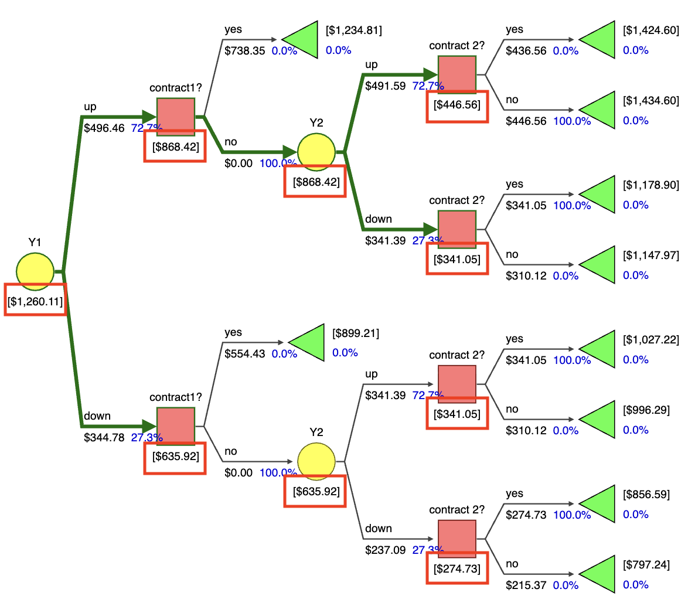
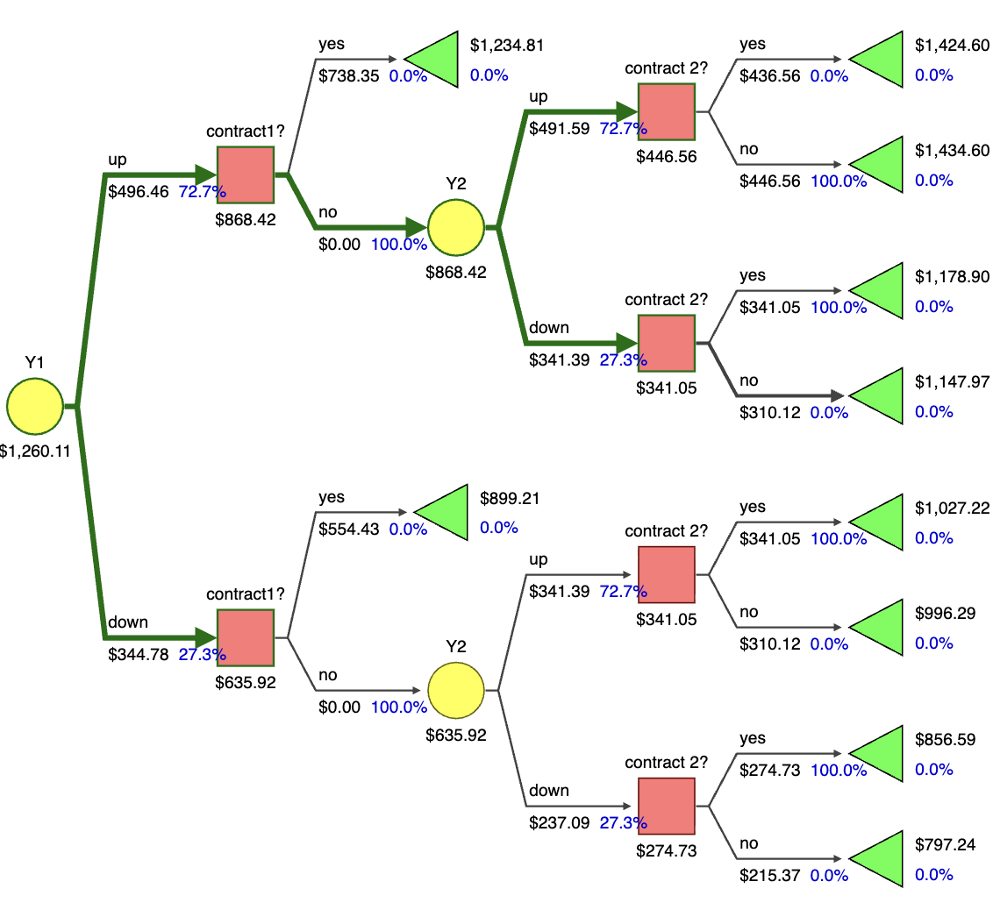
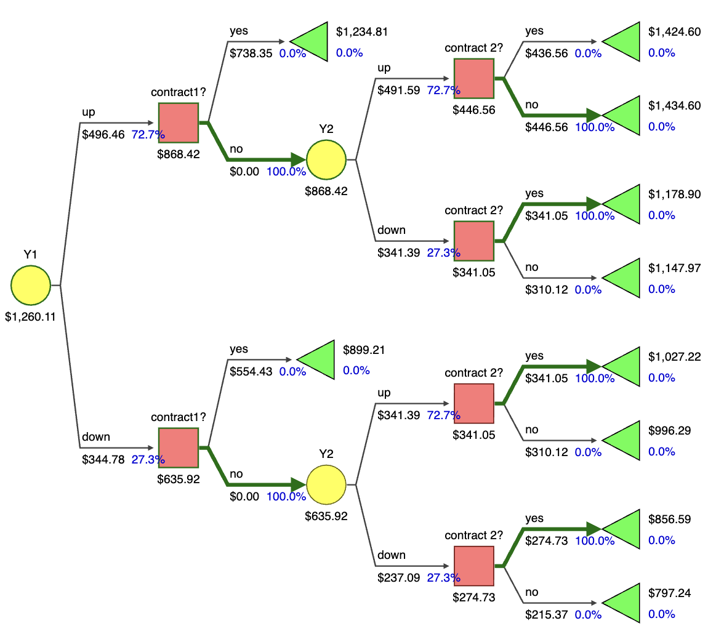
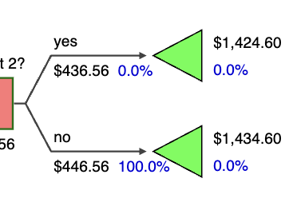
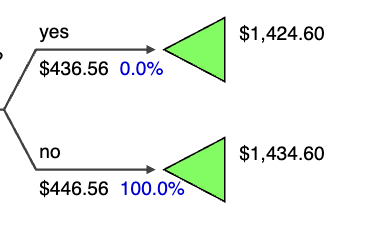

Editing README

# SilverDecisions PeppVer

A fork of [SilverDecisions](https://github.com/SilverDecisions/SilverDecisions) (version 1.2.1), the free tool for creating and analyzing decision trees. PeppVer adds four optional display settings that make trees easier to read in business analytics courses.

**Try it:** https://chat63791.github.io/SilverDecisionsPeppVer/SilverDecisions.html

All four settings are off by default. With them off, PeppVer looks and behaves like the original SilverDecisions, and trees saved in the original open normally.

## What PeppVer adds

Open **Settings** (the gear icon in the top right), scroll down, and click **Other**. Each setting is a checkbox, and your choices are saved with the tree when you download the diagram.

### 1. Show rollback values on decision and chance nodes

- **Off (SilverDecisions):** a decision or chance node shows only its own payoff.
- **On (PeppVer):** the node shows the full rollback value, meaning its own payoff plus the expected value rolled back from the branches below it. This matches a rollback (EMV) calculation done by hand.

| SilverDecisions | PeppVer |
| --- | --- |
|  |  |

### 2. Show computed payoffs in brackets

- **Off (SilverDecisions):** computed values and the numbers you typed in look the same.
- **On (PeppVer):** values the program computed are shown in brackets, so inputs and results are easy to tell apart.

| SilverDecisions | PeppVer |
| --- | --- |
|  |  |

### 3. Thicken only branches with 100% probability

- **Off (SilverDecisions):** the standard thick-line highlighting of the optimal path.
- **On (PeppVer):** a branch is drawn thick only when it is reached with 100% probability, so the thick lines always agree with the probability labels. Related upstream report: [SilverDecisions#236](https://github.com/SilverDecisions/SilverDecisions/issues/236).

| SilverDecisions | PeppVer |
| --- | --- |
|  |  |

### 4. Hide probabilities on terminal nodes

- **Off (SilverDecisions):** every terminal node shows a probability label, including ones like 0.0%.
- **On (PeppVer):** terminal nodes show no probability label, which removes clutter at the ends of the tree.

| SilverDecisions | PeppVer |
| --- | --- |
|  |  |

## Run it locally

You only need Python 3. The `dev` branch already contains the built site in `docs/`.

```
git clone https://github.com/chat63791/SilverDecisionsPeppVer.git
cd SilverDecisionsPeppVer/docs
python3 -m http.server 8080
```

Then open http://localhost:8080/SilverDecisions.html

## Where the changes live

PeppVer is built from source. Nothing is hand-edited in the minified files.

| Repository | Branch | What it holds |
| --- | --- | --- |
| [SilverDecisionsPeppVer](https://github.com/chat63791/SilverDecisionsPeppVer) | `dev` | The deployed site (`docs/`), served by GitHub Pages |
| [SilverDecisionsPeppVer](https://github.com/chat63791/SilverDecisionsPeppVer) | `source-build` | App source: the four checkboxes, their labels, and the About text |
| [sd-tree-designer](https://github.com/chat63791/sd-tree-designer) | `peppver-display-fixes` | The brackets, thickening, and terminal probability options |
| [sd-computations](https://github.com/chat63791/sd-computations) | `peppver-rollback-option` | The rollback option |

Setting names in the code:

| Checkbox | Config option |
| --- | --- |
| Show rollback values on decision and chance nodes | `rollbackPayoffs` |
| Show computed payoffs in brackets | `bracketComputedPayoffs` |
| Thicken only branches with 100% probability | `thickenOnlyCertainBranches` |
| Hide probabilities on terminal nodes | `hideTerminalProbabilityToEnter` |

## Build from source

You need Node.js, npm, and Python 3. Clone the three repositories side by side:

```
mkdir sd-work
cd sd-work
git clone -b source-build https://github.com/chat63791/SilverDecisionsPeppVer.git
git clone -b peppver-display-fixes https://github.com/chat63791/sd-tree-designer.git
git clone -b peppver-rollback-option https://github.com/chat63791/sd-computations.git
```

Install and build:

```
cd SilverDecisionsPeppVer
npm install
npm install ../sd-tree-designer ../sd-computations
npm install sd-expression-engine@0.1.17 sd-random@0.1.4
npx gulp build
npx gulp docs-gen
```

Serve the result:

```
cd docs
python3 -m http.server 8080
```

Notes:

- Run `npx gulp build` and `npx gulp docs-gen`, not plain `npx gulp`. The plain command also runs the test suite.
- Use the `npm install ../...` lines above instead of `npm link`. `npm link` removes two packages the build needs.
- `sd-tree-designer` must be on a branch based on upstream `d3v7`. Upstream `master` is an older version and breaks right-click menus.
- To update the live site, copy the freshly built files in `docs/app/gen/` onto the `dev` branch and push.

## Relationship to the original project

These changes were first offered to the SilverDecisions project as pull requests ([sd-tree-designer#28](https://github.com/SilverDecisions/sd-tree-designer/pull/28), [sd-computations#39](https://github.com/SilverDecisions/sd-computations/pull/39), [SilverDecisions#238](https://github.com/SilverDecisions/SilverDecisions/pull/238)). The maintainers have no developer available to review new code right now and suggested keeping the changes in a fork instead.

Every PeppVer setting is off by default and backward compatible, so the changes can still be submitted upstream later.

## Credits

PeppVer was developed by Terren Chang ([@chat63791](https://github.com/chat63791)) as a capstone project at Pepperdine University, advised by Professor James DiLellio.

## About SilverDecisions

SilverDecisions is software for creating and analyzing decision trees, released under the LGPL-3.0 license (see `LICENSE.txt`).

Citation:
B. Kamiński, M. Jakubczyk, P. Szufel: A framework for sensitivity analysis of decision trees, Central European Journal of Operations Research (2017).
[doi:10.1007/s10100-017-0479-6](https://link.springer.com/article/10.1007/s10100-017-0479-6)

- Original project website: http://www.silverdecisions.pl
- User documentation: [SilverDecisions Wiki](https://github.com/SilverDecisions/SilverDecisions/wiki)
- Technical information: [Developer's Guide](https://github.com/SilverDecisions/SilverDecisions/wiki/Developer%27s-guide)
